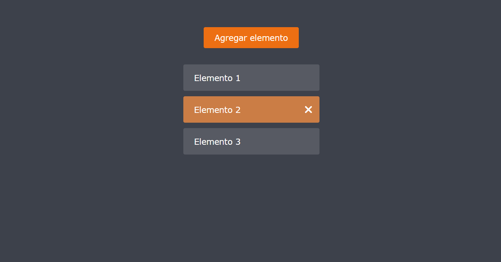

# Mejor forma de manejar los eventos del mouse.

Consiste en agregar el evento al elemento padre, y por medio de la propiedad "target" obtener el elemento hijo al cual se esta dando el click.

* https://jesusbriones2.github.io/Mejor-uso-de-mouseEvent

