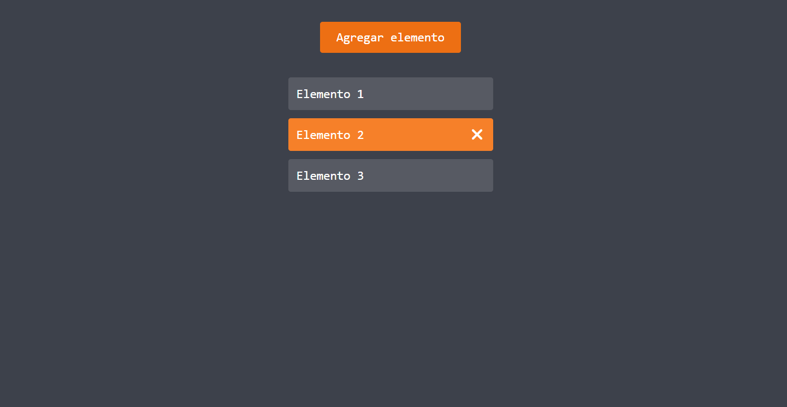

# Mejorar usos de los eventos del mouse
Forma de los eventos del mouse, sobre todo el click de una mejor manera.

Consiste en agregar el evento al elemento padre y por medio de la propiedad "target" obtener el elemento al que esta dando el click.

* link: https://jesusbriones2.github.io/Mejorar_uso_de_mouseEvent

